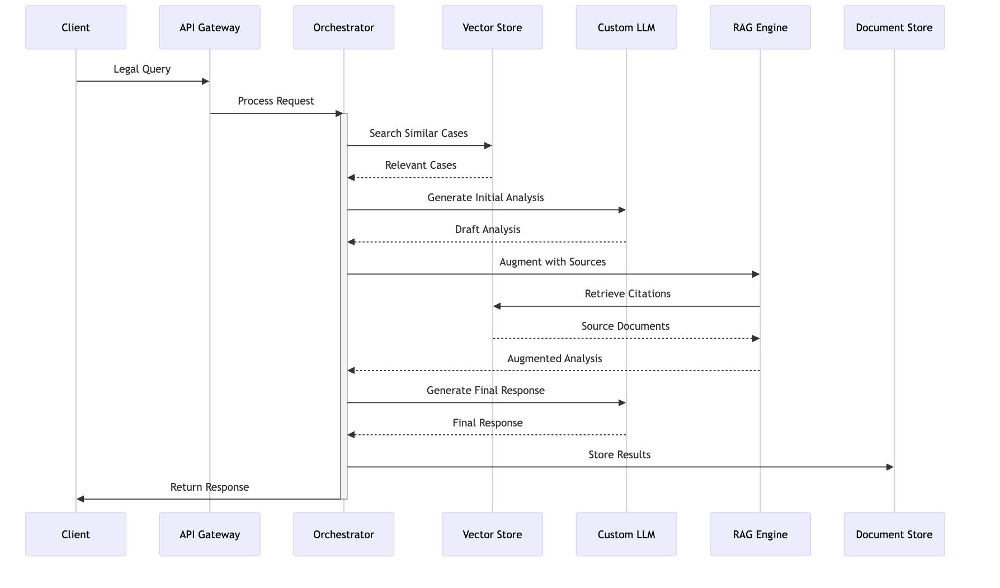
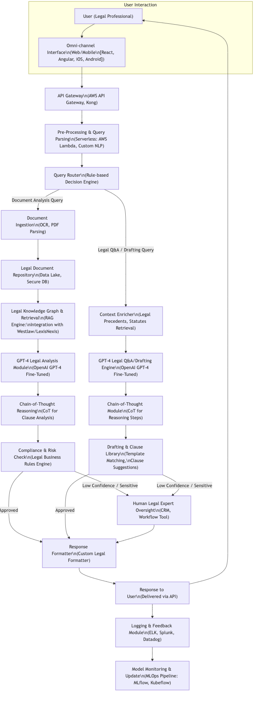
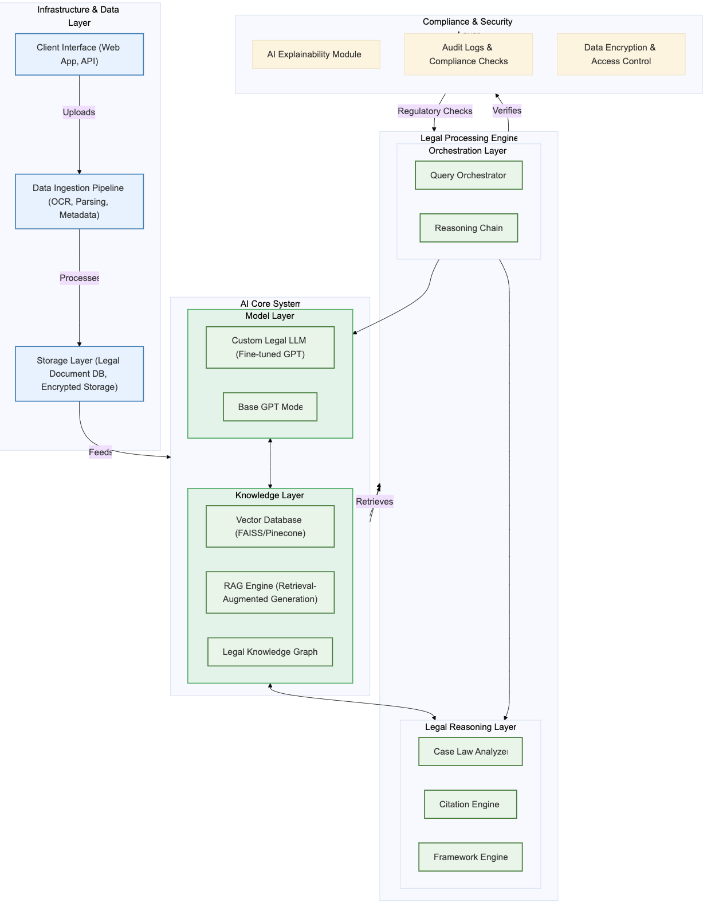
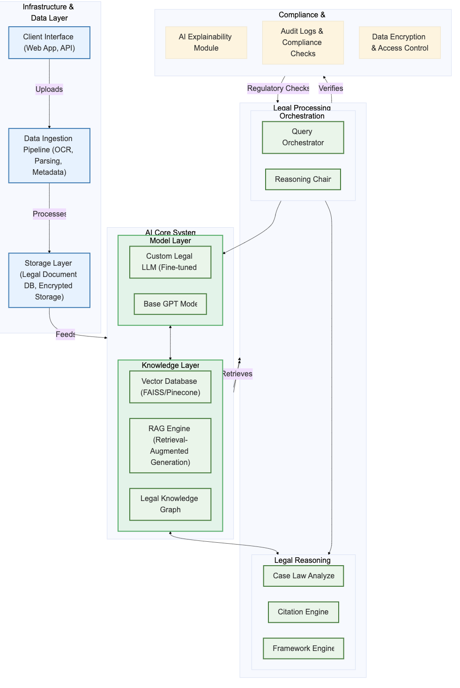

# Harvey Legal AI System Architecture

## Overview
This documentation outlines the architecture of Harvey's legal AI platform, which has established itself as a secure generative AI solution for professionals in law, tax, and finance. The system demonstrates the successful integration of custom-trained models with comprehensive legal knowledge bases.

## System Performance Metrics
Based on Harvey's implementation:
- 83% increase in factual responses
- 97% attorney preference rate for custom model outputs over GPT-4
- Revenue growth of over 10x in 2023
- Successfully processes and analyzes hundreds of thousands of contracts
- Handles millions of emails for litigation review

## Core System Components

### 1. Custom-Trained Case Law Model
#### Model Architecture
- Built in partnership with OpenAI
- Custom-trained on comprehensive legal datasets
- Incorporates 10 billion tokens of legal knowledge
- Specialized in U.S. case law analysis
- Enhanced reasoning capabilities for legal context

#### Knowledge Integration
- Complete U.S. case law database
- Delaware case law specialization
- Legal precedent relationships
- Jurisdictional variations
- Citation frameworks

### 2. Document Processing Pipeline

#### Input Processing
- Contract analysis capabilities
- Email review systems
- Legal document parsing
- Multi-format support
- Metadata extraction

#### Content Analysis
- Source document verification
- Citation tracking
- Legal precedent matching
- Cross-reference validation
- Context preservation

### 3. Query Processing System

#### Query Understanding
- Legal question analysis
- Context identification
- Jurisdiction recognition
- Precedent relevance assessment
- Client requirement interpretation

#### Research Synthesis
- Case law correlation
- Precedent analysis
- Multi-jurisdiction comparison
- Timeline consideration
- Authority weighting

### 4. Response Generation

#### Content Generation
- Comprehensive legal answers
- Source citation integration
- Jurisdiction-specific responses
- Authority-based reasoning
- Nuanced legal analysis

#### Quality Assurance
- Hallucination reduction
- Citation verification
- Legal accuracy checking
- Completeness assessment
- Response validation

### 5. Use Case Implementations

#### Case Law Research
- Direct question answering
- Source citation
- Precedent analysis
- Jurisdictional comparison
- Legal reasoning explanation

#### Document Drafting
- Brief generation
- Motion preparation
- Contract analysis
- Discrepancy identification
- Template customization

#### Litigation Support
- Email review
- Document synthesis
- Evidence analysis
- Argument construction
- Citation compilation

## Advanced Features

### 1. Multi-Model Integration
- Custom case law model
- Base GPT-4 capabilities
- Specialized legal models
- Cross-model verification
- Response synthesis

### 2. Information Retrieval
- RAG system implementation
- Knowledge base integration
- Dynamic content updates
- Source verification
- Citation management

### 3. Agent Architecture
- Multi-model orchestration
- Task decomposition
- Workflow automation
- User interaction reduction
- Complex query handling

## Security & Compliance

### 1. Data Protection
- Secure platform architecture
- Client confidentiality
- Data encryption
- Access control
- Audit logging

### 2. Quality Control
- Accuracy verification
- Citation checking
- Response validation
- Bias detection
- Consistency monitoring

## Best Practices for Implementation

### 1. Model Training
- Custom knowledge integration
- Continuous learning
- Performance monitoring
- Feedback incorporation
- Domain expansion

### 2. System Integration
- Workflow optimization
- User interface design
- Response formatting
- Citation standardization
- Documentation management

### 3. Performance Optimization
- Response time improvement
- Accuracy enhancement
- Resource utilization
- Scalability management
- System monitoring

## Future Development Areas

### 1. Enhanced Capabilities
- Multi-jurisdiction expansion
- Additional practice areas
- Document type coverage
- Language support
- Automation scope

### 2. Agent Development
- Complex task handling
- Workflow automation
- User interaction simplification
- Multi-step processing
- Context maintenance

### More diagrams:

## Conclusion
Harvey's architecture represents a significant advancement in legal AI, demonstrating the value of custom-trained models and sophisticated information processing in the legal domain. The system's success in reducing routine work while maintaining high accuracy and comprehensive legal knowledge makes it a model for future legal technology development.

---

*Note: This architecture evolves continuously with new AI capabilities and legal requirements.*
