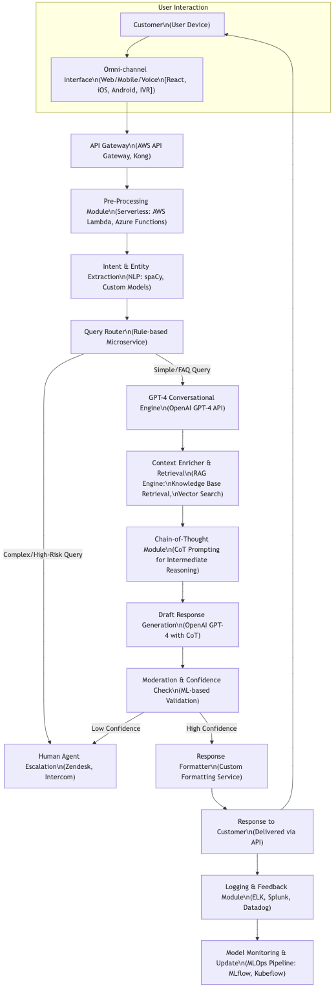

# Klarna AI Customer Support System Architecture

## Overview
This documentation outlines the architecture of an AI-powered customer support system similar to Klarna's implementation, which has demonstrated remarkable efficiency by handling the workload equivalent to 700 full-time agents. The system leverages advanced AI capabilities for customer interaction while maintaining security and regulatory compliance in the financial sector.

## System Performance Metrics
Based on Klarna's implementation:
- 2.3 million conversations handled in the first month
- Customer resolution time reduced from 11 minutes to under 2 minutes
- 25% reduction in repeat inquiries
- Coverage across 23 markets
- Support for 35+ languages
- Estimated $40 million USD profit improvement (2024)
- Customer satisfaction scores comparable to human agents

## System Architecture Components

### 1. User Interaction Layer
- Customer Interface (User Device)
- Omni-channel Interface supports:
  - Web/Mobile/Voice interactions
  - React, iOS, Android, IVR platforms
  - Integration with shopping platform
  - Customer service widgets

### 2. Gateway & Processing Layer
#### API Gateway
- AWS API Gateway/Kong implementation
- Request routing and load balancing
- Authentication and rate limiting
- Session management
- API versioning

#### Pre-Processing Module
- Serverless architecture (AWS Lambda, Azure Functions)
- Input validation and normalization
- Customer identity verification
- Session context management
- Priority queue management

### 3. Core AI Processing Components

#### Intent & Entity Extraction
- NLP Processing using spaCy and Custom Models
- Customer intent classification
- Issue type identification
- Language detection
- Sentiment analysis
- Priority assessment

#### Query Router
- Rule-based Microservice
- Query classification:
  - Simple/FAQ queries
  - Complex support issues
  - High-risk escalations
  - Refund/return requests
  - Payment-related queries

### 4. Support Request Processing Paths

#### Simple/FAQ Query Flow
1. GPT-4 Conversational Engine
   - Initial response generation
   - FAQ matching
   - Basic instruction provision
   - Quick resolution paths

2. Context Enrichment
   - Customer history retrieval
   - Previous interaction analysis
   - Purchase history integration
   - Account status checking

#### Complex/High-Risk Query Flow
1. Enhanced Processing
   - Detailed context analysis
   - Multi-turn conversation handling
   - Solution recommendation generation
   - Step-by-step guidance creation

2. Chain-of-Thought Module
   - Intermediate reasoning steps
   - Solution verification
   - Alternative solution generation
   - Compliance checking

### 5. Response Generation & Quality Control

#### Moderation & Confidence Check
- ML-based validation
- Response appropriateness check
- Compliance verification
- Confidence score calculation

#### Response Paths
- High Confidence
  - Direct automated response
  - Solution implementation
  - Follow-up scheduling
  - Satisfaction survey

- Low Confidence
  - Human agent escalation
  - Supervised response
  - Priority routing
  - Specialist assignment

### 6. System Integration & Monitoring

#### Response Delivery
- Custom formatting service
- Multi-channel delivery
- Notification system
- Follow-up scheduling

#### Logging & Analytics
- ELK Stack implementation
- Splunk analytics
- Performance metrics tracking
- Customer satisfaction monitoring
- Resolution rate tracking

#### Continuous Improvement
- MLOps pipeline
- Model performance monitoring
- Training data collection
- A/B testing framework
- Feature importance analysis

## Security & Compliance Features

### 1. Data Protection
- End-to-end encryption
- Personal data handling compliance
- GDPR compliance
- Data retention policies
- Access control management

### 2. Quality Assurance
- Response accuracy monitoring
- Conversation quality scoring
- Customer satisfaction tracking
- Resolution rate analysis
- Response time monitoring

### 3. Regulatory Compliance
- Financial services regulations
- Consumer protection rules
- Documentation requirements
- Audit trail maintenance
- Compliance reporting

## Best Practices for Implementation

### 1. AI Model Management
- Regular model updates
- Training data curation
- Performance monitoring
- Bias detection
- Quality assurance

### 2. Customer Experience
- Response time optimization
- Conversation flow improvement
- Language support expansion
- Cultural sensitivity
- Accessibility compliance

### 3. System Monitoring
- Real-time performance tracking
- Error rate monitoring
- Customer satisfaction metrics
- Resolution rate analysis
- Escalation pattern analysis

## Conclusion
This AI-powered customer support architecture represents a modern approach to handling customer service at scale, demonstrating significant improvements in efficiency and customer satisfaction while maintaining high quality standards and regulatory compliance.

---

*Note: This architecture should be regularly updated to accommodate new AI capabilities, customer service requirements, and regulatory changes.*
